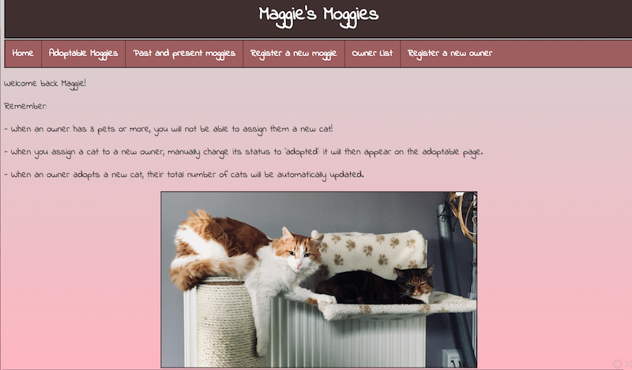

# Cat Adoption Shelter: CodeClan Project 1
A cat adoption shelter management system for tracking customers and cats available to adopt. Built using Ruby, Sinatra and SQL. 
This GitHub repo contains the code for my first CodeClan project, a web app for use by the management of a cat adoption shelter. This web app was built using Ruby, Sinatra, SQL, HTML and CSS. It allows the management to create, read, update and delete (CRUD) potential owners and cats and persistently stores the data of each to a SQL database. 

